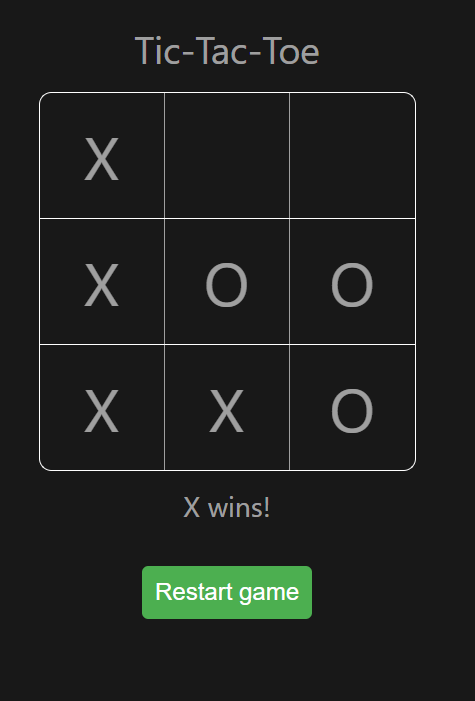

# Vue 3 Project: Tic-Tac-Toe

This is more of a logic study rather than a Vue one, but still interesting to see how logic and components can be used within a Vue environment.  

### You can try it [here](https://vue3-tic-tac-toe.netlify.app/)




## Project Setup

```sh
npm install
```

### Compile and Hot-Reload for Development

```sh
npm run dev
```

### Type-Check, Compile and Minify for Production

```sh
npm run build
```

### Lint with [ESLint](https://eslint.org/)

```sh
npm run lint
```
